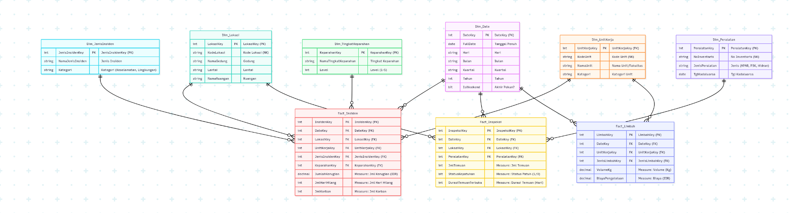

# Data Mart K3L (Kesehatan, Keselamatan Kerja, dan Lingkungan) Institut Teknologi Sumatera

## Project Overview

Proyek ini bertujuan untuk merancang, membangun, dan mengimplementasikan data mart untuk unit K3L ITERA. Tujuannya adalah untuk menyediakan solusi *business intelligence* yang mendukung pengambilan keputusan berbasis data terkait kesehatan, keselamatan kerja, dan manajemen lingkungan di lingkungan kampus.

## Team Members

| NIM | Nama |
| --- | ---- |
| 123450063 | Arya Muda Siregar |
| 122450129 | Vira Putri Maharani |
| 122450021 | Lisa Diani Amelia |
| 123450111 | Zailani Satria |

## Business Domain

Unit K3L bertanggung jawab untuk mengelola semua aspek yang berkaitan dengan kesehatan, keselamatan kerja, dan perlindungan lingkungan di ITERA.

* **Proses Bisnis Utama:**
    * Pelaporan dan investigasi insiden (kecelakaan kerja, nyaris celaka).
    * Inspeksi keselamatan rutin (misal: APAR, hidran, fasilitas).
    * Manajemen limbah (B3, non-B3, medis).
    * Audit dan pelatihan K3.
    * Pemantauan kesehatan (MCU) dan lingkungan.
* **Stakeholders:** Manajer Unit K3L, Staf K3L, Pimpinan Fakultas/Unit Kerja, Auditor Internal.
* **Kebutuhan Pengambilan Keputusan:** Menganalisis tren insiden, mengidentifikasi area berisiko tinggi, memantau kepatuhan inspeksi, dan melacak volume serta biaya pengelolaan limbah.

## Objectives

1.  Menerapkan desain konseptual, logikal, dan fisikal untuk data mart K3L.
2.  Membangun proses ETL untuk mengintegrasikan data dari berbagai sumber (database pelaporan, checklist inspeksi Excel, dll).
3.  Menyediakan dashboard interaktif untuk memantau KPI K3L.

## Key Performance Indicators (KPIs)

* **Safety:** Jumlah Insiden (Kecelakaan, Nyaris Celaka), *Lost Time Injury (LTI)*, *Frequency Rate (FR)*, *Severity Rate (SR)*.
* **Compliance:** Persentase temuan inspeksi yang ditindaklanjuti, Tingkat kepatuhan inspeksi.
* **Environment:** Total volume limbah (B3/Non-B3) per unit kerja, Biaya pengelolaan limbah.

## Architecture

* **Approach**: Kimball Dimensional Modeling (Bottom-up)
* **Database**: Microsoft SQL Server 2022 (on Ubuntu VM)
* **ETL**: Hybrid approach - Python scripts for Extract/Load + T-SQL Stored Procedures for Transform
* **Orchestration**: Apache Airflow 2.7+
* **Visualization**: Power BI Desktop
* **Version Control**: GitHub

## Data Model (Dimensional Model)



### Fact Tables:

* **`Fact_Insiden`**: Menyimpan metrik terkait setiap laporan insiden (korban jiwa, luka, kerugian material)
* **`Fact_Inspeksi`**: Menyimpan metrik dari setiap item yang diinspeksi (temuan masalah, status tindak lanjut)
* **`Fact_Limbah`**: Menyimpan metrik volume dan biaya limbah yang dihasilkan per jenis limbah

### Dimension Tables:

* **`Dim_Date`**: Dimensi waktu (Tanggal, Bulan, Kuartal, Tahun, 2023-2030)
* **`Dim_Lokasi`**: Lokasi kejadian/inspeksi (Gedung, Lantai, Ruangan, Kapasitas)
* **`Dim_JenisInsiden`**: Jenis insiden (Kecelakaan Kerja, Nyaris Celaka, Insiden Lingkungan, dll)
* **`Dim_TingkatKeparahan`**: Tingkat keparahan (Ringan, Sedang, Berat, Fatal)
* **`Dim_UnitKerja`**: Unit kerja (Fakultas, Departemen, Unit Penunjang) - **SCD Type 2**
* **`Dim_Peralatan`**: Peralatan K3 (APAR, Hidran, Kotak P3K, Detektor Asap)
* **`Dim_JenisLimbah`**: Jenis limbah (B3 Padat, B3 Cair, Medis, Non-B3, Organik)

## Quick Start

### Prerequisites

- Ubuntu 20.04+ dengan SQL Server 2022
- Python 3.8+
- Apache Airflow 2.7+
- Akses `sudo` dan SQL Server `sa`

### Installation

```bash
# 1. Clone repository
git clone https://github.com/your-org/k3l-datamart.git ~/k3l
cd ~/k3l

# 2. Setup Python environment
python3 -m venv venv
source venv/bin/activate
pip install -r requirements.txt

# 3. Deploy database
cd ~/k3l/sql
export SQLCMDSERVER=localhost
export SQLCMDUSER=sa
export SQLCMDPASSWORD='YourPassword'

# Execute scripts in order
sqlcmd -i 01_Create_Database.sql
sqlcmd -d K3L_DataMart -i 02_Create_Dimensions.sql
sqlcmd -d K3L_DataMart -i 03_Create_Facts.sql
sqlcmd -d K3L_DataMart -i 05_Create_Partitions.sql
sqlcmd -d K3L_DataMart -i 04_Create_Indexes.sql
sqlcmd -d K3L_DataMart -i 06_Create_Staging.sql
sqlcmd -d K3L_DataMart -i 07_Create_Procedures.sql

# 4. Setup Airflow
export AIRFLOW_HOME=~/airflow
airflow db init
airflow users create --username admin --password admin123 \
    --firstname Admin --lastname K3L --role Admin \
    --email admin@itera.ac.id

# 5. Configure Airflow connection
airflow connections add k3l_db \
    --conn-type mssql --conn-host localhost \
    --conn-schema K3L_DataMart --conn-login sa \
    --conn-password 'YourPassword' --conn-port 1433

# 6. Start services
airflow webserver -p 8080 &
airflow scheduler &
```

Untuk panduan lengkap, lihat [INSTALLATION.md](INSTALLATION.md).

## ETL Workflow

### Data Flow

```
Source Files (Excel/CSV)
    ↓ Python Extract
Staging Tables (STG_*)
    ↓ SQL Transform
Dimension Tables (Dim_*)
    ↓ SQL Load with FK Lookup
Fact Tables (Fact_*)
    ↓ Data Quality Checks
Data Mart (Ready for BI)
```

### Running ETL

**Manual execution:**
```sql
-- Run complete ETL process
EXEC dbo.usp_ETL_Master 
    @LoadDimensions = 1,
    @LoadFacts = 1;

-- Check staging statistics
EXEC dbo.usp_Get_StagingStatistics;

-- Run data quality checks
sqlcmd -d K3L_DataMart -i sql/08_DataQuality_Checks.sql
```

**Airflow orchestration:**
```bash
# Trigger DAG manually
airflow dags trigger k3l_etl_master

# Check DAG status
airflow dags list-runs -d k3l_etl_master

# View logs
airflow tasks logs k3l_etl_master load_dimensions <execution_date>
```

**Scheduled execution:**
- **Daily ETL**: 02:00 WIB (transactional data)
- **Monthly Master Data Refresh**: 1st of month, 01:00 WIB

## Database Structure

### SQL Scripts

| File | Purpose | Execution Order |
|------|---------|-----------------|
| `01_Create_Database.sql` | Create database and basic configuration | 1 |
| `02_Create_Dimensions.sql` | Create 7 dimension tables | 2 |
| `03_Create_Facts.sql` | Create 3 fact tables with FK constraints | 3 |
| `05_Create_Partitions.sql` | Implement quarterly partitioning (2023-2030) | 4 |
| `04_Create_Indexes.sql` | Create ~35 indexes for performance | 5 |
| `06_Create_Staging.sql` | Create 6 staging tables + utility procedures | 6 |
| `07_Create_Procedures.sql` | Create 11 ETL stored procedures | 7 |
| `08_DataQuality_Checks.sql` | Data quality validation queries | Ad-hoc |

**Warning**: Script 05 akan DROP dan RECREATE fact tables. Backup dulu jika ada data!

### Key Features

- **Partitioning**: Quarterly partitioning on `DateKey` (33 partitions: 2023 Q1 - 2030 Q4)
- **SCD Type 2**: Implemented on `Dim_UnitKerja` (track historical changes)
- **SCD Type 1**: Other dimensions (overwrite on change)
- **Error Handling**: Row-level error logging in staging tables (`ETL_ErrorMessage`)
- **Incremental Load**: Process only unprocessed records (`IsProcessed = 0`)

## Data Quality Framework

K3L Data Mart implements comprehensive data quality checks:

1. **Referential Integrity**: No orphan records in fact tables
2. **Data Completeness**: No NULLs in mandatory fields
3. **Data Validity**: No negative values, valid date ranges
4. **Data Consistency**: Business rules validation (e.g., severity vs casualties)
5. **Duplicate Detection**: No duplicate natural keys in dimensions
6. **Staging Quality**: Monitor unprocessed records and ETL errors

Run checks:
```bash
sqlcmd -d K3L_DataMart -i sql/08_DataQuality_Checks.sql -o /tmp/dq_report.txt
```

## Troubleshooting

### Common Issues

**Cannot connect to SQL Server:**
```bash
sudo systemctl status mssql-server
sudo systemctl restart mssql-server
```

**ETL procedure fails:**
```sql
-- Check staging errors
SELECT TableName, ETL_ErrorMessage, COUNT(*) AS ErrorCount
FROM (
    SELECT 'STG_Insiden' AS TableName, ETL_ErrorMessage FROM STG_Insiden WHERE ETL_ErrorMessage IS NOT NULL
    UNION ALL
    SELECT 'STG_Inspeksi', ETL_ErrorMessage FROM STG_Inspeksi WHERE ETL_ErrorMessage IS NOT NULL
    UNION ALL
    SELECT 'STG_Limbah', ETL_ErrorMessage FROM STG_Limbah WHERE ETL_ErrorMessage IS NOT NULL
) errors
GROUP BY TableName, ETL_ErrorMessage;
```

**Airflow DAG not showing:**
```bash
airflow dags list-import-errors
python ~/airflow/dags/<dag_file>.py  # Check syntax
```

**Performance issues:**
```sql
-- Check index usage
SELECT 
    OBJECT_NAME(i.object_id) AS TableName,
    i.name AS IndexName,
    s.user_seeks, s.user_scans, s.user_lookups,
    s.user_updates
FROM sys.indexes i
LEFT JOIN sys.dm_db_index_usage_stats s ON i.object_id = s.object_id AND i.index_id = s.index_id
WHERE OBJECT_NAME(i.object_id) LIKE 'Fact_%'
ORDER BY TableName, IndexName;
```

## Documentation

### Requirements & Design
* [Business Requirements](docs/01-requirements/business-requirements.md) - Business objectives, stakeholders, KPIs
* [Data Sources](docs/01-requirements/data_sources.md) - Source systems and data mapping
* [Data Dictionary](docs/02-design/data-dictionary-k3l.xlsx) - Complete attribute definitions
* [Conceptual ERD](docs/02-design/ERD-K3L.md) - Entity relationships and business rules
* [Dimensional Model](docs/02-design/dimensional-model-k3l.md) - Star schema design

### Implementation
* **[ETL Documentation](docs/03-implementation/etl-documentation.md)** - Complete ETL process guide
* **[INSTALLATION.md](INSTALLATION.md)** - Step-by-step installation guide
* **[DEPLOYMENT.md](DEPLOYMENT.md)** - Production deployment checklist
* [Operations Manual](docs/03-implementation/operations-manual.pdf) - Day-to-day operations
* [User Manual](docs/03-implementation/user-manual.pdf) - End-user guide for BI dashboard

### SQL Scripts
All scripts located in `/sql` directory:
- Database setup: `01_Create_Database.sql`
- Dimensions: `02_Create_Dimensions.sql`
- Facts: `03_Create_Facts.sql`
- Indexes: `04_Create_Indexes.sql`
- Partitioning: `05_Create_Partitions.sql`
- Staging: `06_Create_Staging.sql`
- ETL Procedures: `07_Create_Procedures.sql`
- Data Quality: `08_DataQuality_Checks.sql`

## Project Status

### Completed ✅
- [x] Business requirements gathering
- [x] Conceptual data model (ERD)
- [x] Dimensional model (star schema)
- [x] SQL Server database setup
- [x] All dimension tables (7)
- [x] All fact tables (3)
- [x] Quarterly partitioning (2023-2030)
- [x] Comprehensive indexing (~35 indexes)
- [x] Staging tables (6) with ETL control
- [x] ETL stored procedures (11)
- [x] Data quality validation framework
- [x] ETL documentation
- [x] Installation guide
- [x] Deployment guide

### In Progress
- [ ] Python ETL scripts for extract/load
- [ ] Airflow DAG development
- [ ] Power BI dashboard development
- [ ] User acceptance testing

### Planned
- [ ] Performance tuning
- [ ] Automated alerting
- [ ] Historical data migration
- [ ] Advanced analytics (ML models)

## Contributing

1. Fork the repository
2. Create feature branch (`git checkout -b feature/AmazingFeature`)
3. Commit changes (`git commit -m 'Add AmazingFeature'`)
4. Push to branch (`git push origin feature/AmazingFeature`)
5. Open Pull Request


## Contact

**Project Team:**
- **Arya Muda Siregar** (123450063) 
- **Vira Putri Maharani** (122450129)
- **Lisa Diani Amelia** (122450021)
- **Zailani Satria** (123450111)

## Acknowledgments

- Unit K3L ITERA untuk business requirements
- Tim IT ITERA untuk infrastructure support
- Dosen pembimbing untuk guidance
- Ralph Kimball untuk dimensional modeling methodology

---

**Version**: 1.0  
**Status**: Production Ready 