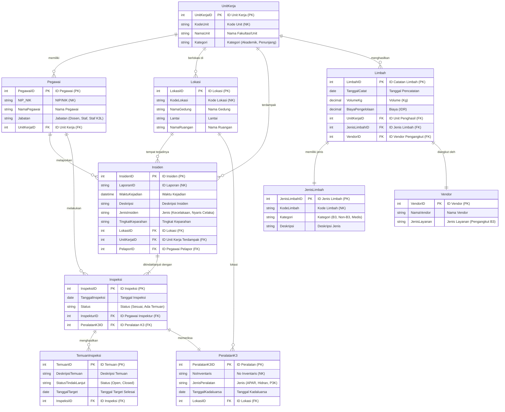

```mermaid
%% ERD Konseptual untuk Data Mart K3L ITERA
%% Menggunakan notasi Crow's Foot (Kaki Gagak)
erDiagram
    UnitKerja {
        int UnitKerjaID PK "ID Unit Kerja (PK)"
        string KodeUnit "Kode Unit (NK)"
        string NamaUnit "Nama Fakultas/Unit"
        string Kategori "Kategori (Akademik, Penunjang)"
    }

    Lokasi {
        int LokasiID PK "ID Lokasi (PK)"
        string KodeLokasi "Kode Lokasi (NK)"
        string NamaGedung "Nama Gedung"
        string Lantai "Lantai"
        string NamaRuangan "Nama Ruangan"
    }

    Pegawai {
        int PegawaiID PK "ID Pegawai (PK)"
        string NIP_NIK "NIP/NIK (NK)"
        string NamaPegawai "Nama Pegawai"
        string Jabatan "Jabatan (Dosen, Staf, Staf K3L)"
        int UnitKerjaID FK "ID Unit Kerja (FK)"
    }

    Insiden {
        int InsidenID PK "ID Insiden (PK)"
        string LaporanID "ID Laporan (NK)"
        datetime WaktuKejadian "Waktu Kejadian"
        string Deskripsi "Deskripsi Insiden"
        string JenisInsiden "Jenis (Kecelakaan, Nyaris Celaka)"
        string TingkatKeparahan "Tingkat Keparahan"
        int LokasiID FK "ID Lokasi (FK)"
        int UnitKerjaID FK "ID Unit Kerja Terdampak (FK)"
        int PelaporID FK "ID Pegawai Pelapor (FK)"
    }

    Inspeksi {
        int InspeksiID PK "ID Inspeksi (PK)"
        date TanggalInspeksi "Tanggal Inspeksi"
        string Status "Status (Sesuai, Ada Temuan)"
        int InspekturID FK "ID Pegawai Inspektur (FK)"
        int PeralatanK3ID FK "ID Peralatan K3 (FK)"
    }

    TemuanInspeksi {
        int TemuanID PK "ID Temuan (PK)"
        string DeskripsiTemuan "Deskripsi Temuan"
        string StatusTindakLanjut "Status (Open, Closed)"
        date TanggalTarget "Tanggal Target Selesai"
        int InspeksiID FK "ID Inspeksi (FK)"
    }

    PeralatanK3 {
        int PeralatanK3ID PK "ID Peralatan (PK)"
        string NoInventaris "No Inventaris (NK)"
        string JenisPeralatan "Jenis (APAR, Hidran, P3K)"
        date TanggalKadaluarsa "Tanggal Kadaluarsa"
        int LokasiID FK "ID Lokasi (FK)"
    }

    Limbah {
        int LimbahID PK "ID Catatan Limbah (PK)"
        date TanggalCatat "Tanggal Pencatatan"
        decimal VolumeKg "Volume (Kg)"
        decimal BiayaPengelolaan "Biaya (IDR)"
        int UnitKerjaID FK "ID Unit Penghasil (FK)"
        int JenisLimbahID FK "ID Jenis Limbah (FK)"
        int VendorID FK "ID Vendor Pengangkut (FK)"
    }

    JenisLimbah {
        int JenisLimbahID PK "ID Jenis Limbah (PK)"
        string KodeLimbah "Kode Limbah (NK)"
        string Kategori "Kategori (B3, Non-B3, Medis)"
        string Deskripsi "Deskripsi Jenis"
    }

    Vendor {
        int VendorID PK "ID Vendor (PK)"
        string NamaVendor "Nama Vendor"
        string JenisLayanan "Jenis Layanan (Pengangkut B3)"
    }

    %% Relationships (Relasi Antar Entitas)
    UnitKerja ||--o{ Pegawai : "memiliki"
    UnitKerja ||--o{ Lokasi : "berlokasi di"
    UnitKerja ||--o{ Insiden : "terdampak"
    UnitKerja ||--o{ Limbah : "menghasilkan"

    Lokasi ||--o{ Insiden : "tempat terjadinya"
    Lokasi ||--o{ PeralatanK3 : "lokasi"

    Pegawai ||--o{ Insiden : "melaporkan"
    Pegawai ||--o{ Inspeksi : "melakukan"

    Insiden ||--|{ Inspeksi : "ditindaklanjuti dengan"
    
    Inspeksi ||--o{ TemuanInspeksi : "menghasilkan"
    Inspeksi ||--|| PeralatanK3 : "memeriksa"
    
    Limbah ||--|| JenisLimbah : "memiliki jenis"
    Limbah ||--|| Vendor : "diangkut oleh"
```
