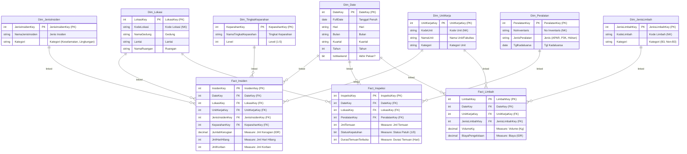

```mermaid
%% Dimensional Model (Star Schema) untuk Data Mart K3L
%% Menggunakan notasi Crow's Foot
erDiagram

    %% Conformed Dimensions (Dimensi Bersama)
    Dim_Date {
        int DateKey PK "DateKey (PK)"
        date FullDate "Tanggal Penuh"
        string Hari "Hari"
        string Bulan "Bulan"
        string Kuartal "Kuartal"
        int Tahun "Tahun"
        bit IsWeekend "Akhir Pekan?"
    }

    Dim_Lokasi {
        int LokasiKey PK "LokasiKey (PK)"
        string KodeLokasi "Kode Lokasi (NK)"
        string NamaGedung "Gedung"
        string Lantai "Lantai"
        string NamaRuangan "Ruangan"
    }

    Dim_UnitKerja {
        int UnitKerjaKey PK "UnitKerjaKey (PK)"
        string KodeUnit "Kode Unit (NK)"
        string NamaUnit "Nama Unit/Fakultas"
        string Kategori "Kategori Unit"
    }

    %% Dimensions for Fact_Insiden
    Dim_JenisInsiden {
        int JenisInsidenKey PK "JenisInsidenKey (PK)"
        string NamaJenisInsiden "Jenis Insiden"
        string Kategori "Kategori (Keselamatan, Lingkungan)"
    }

    Dim_TingkatKeparahan {
        int KeparahanKey PK "KeparahanKey (PK)"
        string NamaTingkatKeparahan "Tingkat Keparahan"
        int Level "Level (1-5)"
    }

    %% Dimensions for Fact_Inspeksi
    Dim_Peralatan {
        int PeralatanKey PK "PeralatanKey (PK)"
        string NoInventaris "No Inventaris (NK)"
        string JenisPeralatan "Jenis (APAR, P3K, Hidran)"
        date TglKadaluarsa "Tgl Kadaluarsa"
    }

    %% Dimensions for Fact_Limbah
    Dim_JenisLimbah {
        int JenisLimbahKey PK "JenisLimbahKey (PK)"
        string KodeLimbah "Kode Limbah (NK)"
        string Kategori "Kategori (B3, Non-B3)"
    }

    %% Fact Tables (Tabel Fakta)

    Fact_Insiden {
        int InsidenKey PK "InsidenKey (PK)"
        int DateKey FK "DateKey (FK)"
        int LokasiKey FK "LokasiKey (FK)"
        int UnitKerjaKey FK "UnitKerjaKey (FK)"
        int JenisInsidenKey FK "JenisInsidenKey (FK)"
        int KeparahanKey FK "KeparahanKey (FK)"
        decimal JumlahKerugian "Measure: Jml Kerugian (IDR)"
        int JmlHariHilang "Measure: Jml Hari Hilang"
        int JmlKorban "Measure: Jml Korban"
    }

    Fact_Inspeksi {
        int InspeksiKey PK "InspeksiKey (PK)"
        int DateKey FK "DateKey (FK)"
        int LokasiKey FK "LokasiKey (FK)"
        int PeralatanKey FK "PeralatanKey (FK)"
        int JmlTemuan "Measure: Jml Temuan"
        bit StatusKepatuhan "Measure: Status Patuh (1/0)"
        int DurasiTemuanTerbuka "Measure: Durasi Temuan (Hari)"
    }

    Fact_Limbah {
        int LimbahKey PK "LimbahKey (PK)"
        int DateKey FK "DateKey (FK)"
        int UnitKerjaKey FK "UnitKerjaKey (FK)"
        int JenisLimbahKey FK "JenisLimbahKey (FK)"
        decimal VolumeKg "Measure: Volume (Kg)"
        decimal BiayaPengelolaan "Measure: Biaya (IDR)"
    }

    %% Relationships (Relasi)
    Dim_Date ||--o{ Fact_Insiden : "linked"
    Dim_Lokasi ||--o{ Fact_Insiden : "linked"
    Dim_UnitKerja ||--o{ Fact_Insiden : "linked"
    Dim_JenisInsiden ||--o{ Fact_Insiden : "linked"
    Dim_TingkatKeparahan ||--o{ Fact_Insiden : "linked"

    Dim_Date ||--o{ Fact_Inspeksi : "linked"
    Dim_Lokasi ||--o{ Fact_Inspeksi : "linked"
    Dim_Peralatan ||--o{ Fact_Inspeksi : "linked"

    Dim_Date ||--o{ Fact_Limbah : "linked"
    Dim_UnitKerja ||--o{ Fact_Limbah : "linked"
    Dim_JenisLimbah ||--o{ Fact_Limbah : "linked"
```

