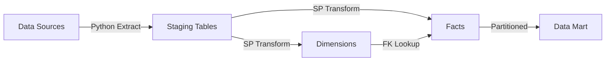
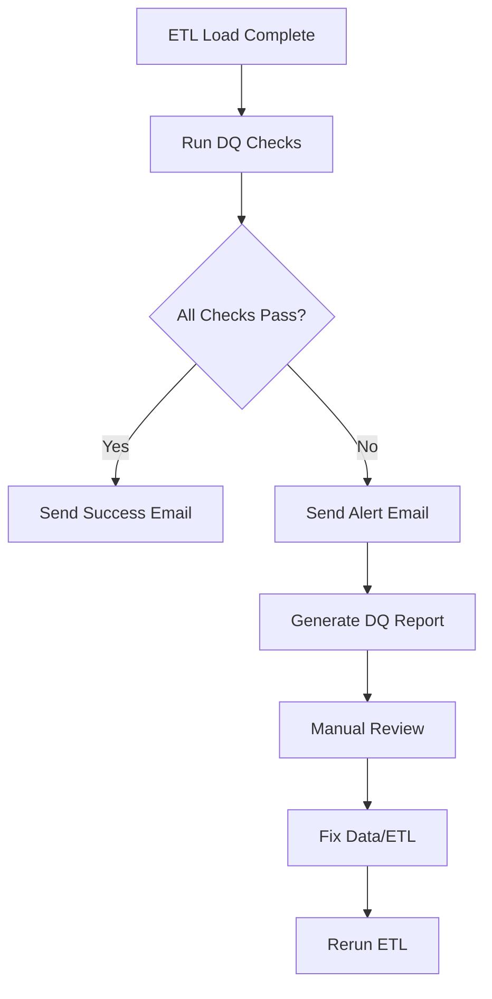

# Dokumentasi ETL - K3L Data Mart

## Daftar Isi
1. [Pendahuluan](#pendahuluan)
2. [Arsitektur ETL](#arsitektur-etl)
3. [Data Flow](#data-flow)
4. [Sistem Sumber](#sistem-sumber)
5. [Staging Layer](#staging-layer)
6. [Proses ETL](#proses-etl)
7. [Integrasi Airflow](#integrasi-airflow)
8. [Error Handling](#error-handling)
9. [Data Quality](#data-quality)
10. [Monitoring dan Logging](#monitoring-dan-logging)

---

## 1. Pendahuluan

### 1.1 Tujuan Dokumen
Dokumen ini menjelaskan proses Extract, Transform, dan Load (ETL) untuk K3L Data Mart Institut Teknologi Sumatera (ITERA). Data Mart ini dirancang untuk mendukung analisis dan pelaporan terkait Kesehatan, Keselamatan, dan Lingkungan (K3L) di kampus ITERA.

### 1.2 Lingkup
ETL mencakup:
- **Extract**: Pengambilan data dari berbagai sistem sumber
- **Transform**: Pembersihan, validasi, dan transformasi data menggunakan stored procedures
- **Load**: Pemuatan data ke dimension dan fact tables dengan partitioning

### 1.3 Teknologi yang Digunakan
- **Database**: Microsoft SQL Server 2022 (on Ubuntu VM)
- **ETL Orchestration**: Apache Airflow
- **Scripting**: Python (untuk extract/load), T-SQL (untuk transform)
- **Modeling**: Kimball Dimensional Modeling (Star Schema)

---

## 2. Arsitektur ETL

### 2.1 Arsitektur Hybrid
K3L Data Mart menggunakan pendekatan **hybrid ETL**:

```
┌──────────────────┐
│  Source Systems  │
│  (Excel, CSV,    │
│   Manual Entry)  │
└────────┬─────────┘
         │
         │ Python Scripts (Extract)
         ▼
┌──────────────────┐
│ Staging Tables   │
│ (STG_* tables)   │
│ - Raw data       │
│ - All NVARCHAR   │
└────────┬─────────┘
         │
         │ SQL Stored Procedures (Transform)
         ▼
┌──────────────────┐
│ Dimension Tables │
│ (Dim_* tables)   │
└────────┬─────────┘
         │
         │ SQL Stored Procedures (Load)
         ▼
┌──────────────────┐
│  Fact Tables     │
│ (Fact_* tables)  │
│ - Partitioned    │
└──────────────────┘
```

### 2.2 Komponen Utama

| Komponen | Teknologi | Fungsi |
|----------|-----------|--------|
| **Extract** | Python + Pandas | Baca data dari Excel/CSV, load ke staging |
| **Transform** | T-SQL Stored Procedures | Validasi, konversi tipe data, lookup surrogate keys |
| **Load** | T-SQL Stored Procedures | Insert ke dimension/fact dengan SCD handling |
| **Orchestration** | Apache Airflow | Scheduling, dependency management, monitoring |

---

## 3. Data Flow

### 3.1 End-to-End Data Flow



### 3.2 Tahapan Proses

1. **Extract (Python)**
   - Baca file Excel/CSV dari shared folder
   - Validasi format file
   - Load raw data ke staging tables (semua kolom NVARCHAR)
   - Set ETL_InsertDate, IsProcessed=0

2. **Transform & Load (SQL Stored Procedures)**
   - **Dimension Load**: 
     - Lookup existing records
     - Apply SCD Type 1 atau Type 2
     - Insert/Update dimension tables
   - **Fact Load**:
     - Lookup surrogate keys untuk FKs
     - Validasi referential integrity
     - Konversi tipe data (NVARCHAR → INT/DECIMAL/DATE)
     - Insert ke fact tables
   - **Error Handling**:
     - Log errors ke ETL_ErrorMessage
     - Skip bad records, continue processing

3. **Post-Load**
   - Update IsProcessed=1 dan ETL_ProcessedDate
   - Run data quality checks
   - Archive/truncate staging tables

---

## 4. Sistem Sumber

### 4.1 Daftar Sumber Data

| Subject Area | Sumber Data | Format | Frekuensi | PIC |
|--------------|-------------|--------|-----------|-----|
| **Insiden K3** | Form Laporan Insiden | Excel | Ad-hoc | Unit K3L |
| **Inspeksi Peralatan** | Checklist Inspeksi | Excel | Bulanan | Teknisi |
| **Pengelolaan Limbah** | Log Pengelolaan Limbah | CSV | Bulanan | Unit Lingkungan |
| **Data Lokasi** | Master Data Gedung | Excel | Tahunan | BAAK |
| **Data Unit Kerja** | Master Organisasi | Excel | Semester | BAAK |
| **Data Peralatan** | Inventaris Peralatan | Excel | Semester | BMN |

### 4.2 Lokasi File Sumber
Semua file sumber disimpan di shared folder:
```
/data/k3l/sources/
├── insiden/
├── inspeksi/
├── limbah/
└── master_data/
```

### 4.3 Naming Convention File
- **Insiden**: `insiden_YYYYMMDD.xlsx`
- **Inspeksi**: `inspeksi_YYYYMM.xlsx`
- **Limbah**: `limbah_YYYYMM.csv`
- **Master Data**: `master_lokasi_YYYYMMDD.xlsx`, `master_unitkerja_YYYYMMDD.xlsx`

---

## 5. Staging Layer

### 5.1 Tujuan Staging
- **Landing zone** untuk data mentah dari berbagai sumber
- **Buffer** antara source systems dan data warehouse
- **Audit trail** untuk tracking ETL errors
- **Reprocessing**: Data bisa di-reprocess jika ada error

### 5.2 Struktur Staging Tables

Semua staging tables memiliki struktur serupa:

```sql
CREATE TABLE dbo.STG_<SubjectArea> (
    -- Business columns (all NVARCHAR for flexibility)
    <Column1> NVARCHAR(MAX),
    <Column2> NVARCHAR(MAX),
    ...
    
    -- ETL Control Columns
    ETL_InsertDate DATETIME DEFAULT GETDATE(),
    ETL_ProcessedDate DATETIME NULL,
    IsProcessed BIT DEFAULT 0,
    ETL_ErrorMessage NVARCHAR(MAX) NULL
);
```

### 5.3 Daftar Staging Tables

| Table Name | Purpose | Row Estimate |
|------------|---------|--------------|
| `STG_Lokasi` | Master lokasi gedung/ruangan | ~100 rows |
| `STG_UnitKerja` | Master unit kerja/fakultas | ~50 rows |
| `STG_Peralatan` | Master peralatan K3 | ~200 rows |
| `STG_Insiden` | Transaksional insiden K3 | ~500 rows/tahun |
| `STG_Inspeksi` | Transaksional inspeksi | ~1000 rows/tahun |
| `STG_Limbah` | Transaksional pengelolaan limbah | ~500 rows/tahun |

### 5.4 Utility Procedures

```sql
-- Truncate semua staging tables
EXEC dbo.usp_Truncate_AllStaging;

-- Get statistik staging
EXEC dbo.usp_Get_StagingStatistics;

-- Clear records yang sudah diproses
EXEC dbo.usp_Clear_ProcessedStaging @DaysToKeep = 30;
```

---

## 6. Proses ETL

### 6.1 Subject Area: Insiden K3

#### 6.1.1 Extract (Python)
```python
# Pseudocode
def extract_insiden():
    # Read Excel file
    df = pd.read_excel('/data/k3l/sources/insiden/insiden_YYYYMMDD.xlsx')
    
    # Validate columns
    required_cols = ['TanggalInsiden', 'LokasiNama', 'JenisInsidenNama', ...]
    validate_columns(df, required_cols)
    
    # Load to staging
    df.to_sql('STG_Insiden', engine, if_exists='append', index=False)
```

#### 6.1.2 Transform & Load (SQL)
```sql
-- Transform dimensions (if new data)
EXEC dbo.usp_Load_Dim_Lokasi;       -- SCD Type 1
EXEC dbo.usp_Load_Dim_UnitKerja;    -- SCD Type 2
EXEC dbo.usp_Load_Dim_JenisInsiden; -- Static (no procedure needed)

-- Transform & load fact
EXEC dbo.usp_Load_Fact_Insiden;
```

**Logika `usp_Load_Fact_Insiden`:**
1. Loop cursor over `STG_Insiden WHERE IsProcessed = 0`
2. Untuk setiap row:
   - Validasi mandatory fields (DateKey, LokasiKey, JenisInsidenKey)
   - Lookup surrogate keys:
     ```sql
     EXEC usp_GetSurrogateKey_Lokasi @LokasiNama, @LokasiKey OUTPUT;
     EXEC usp_GetSurrogateKey_UnitKerja @UnitKerjaNama, @UnitKerjaKey OUTPUT;
     EXEC usp_GetSurrogateKey_JenisInsiden @JenisInsidenNama, @JenisInsidenKey OUTPUT;
     ```
   - Konversi tipe data (NVARCHAR → INT/DECIMAL)
   - INSERT ke `Fact_Insiden`
   - UPDATE `STG_Insiden` SET `IsProcessed = 1`, `ETL_ProcessedDate = GETDATE()`
3. Handle errors → UPDATE `ETL_ErrorMessage`

#### 6.1.3 Handling SCD Type 2 (Dim_UnitKerja)
```sql
-- Check if attribute changed
IF EXISTS (SELECT 1 FROM Dim_UnitKerja 
           WHERE NamaUnitKerja = @NamaUnitKerja 
             AND IsCurrent = 1
             AND (KepalaNama <> @KepalaNama OR Lokasi <> @Lokasi))
BEGIN
    -- Expire old record
    UPDATE Dim_UnitKerja
    SET IsCurrent = 0, EndDate = GETDATE()
    WHERE NamaUnitKerja = @NamaUnitKerja AND IsCurrent = 1;
    
    -- Insert new version
    INSERT INTO Dim_UnitKerja (NamaUnitKerja, KepalaNama, Lokasi, 
                                IsCurrent, StartDate, EndDate)
    VALUES (@NamaUnitKerja, @KepalaNama, @Lokasi, 
            1, GETDATE(), '9999-12-31');
END
```

---

### 6.2 Subject Area: Inspeksi Peralatan

#### 6.2.1 Extract (Python)
```python
def extract_inspeksi():
    df = pd.read_excel('/data/k3l/sources/inspeksi/inspeksi_YYYYMM.xlsx')
    df.to_sql('STG_Inspeksi', engine, if_exists='append', index=False)
```

#### 6.2.2 Transform & Load (SQL)
```sql
-- Transform dimensions
EXEC dbo.usp_Load_Dim_Lokasi;
EXEC dbo.usp_Load_Dim_Peralatan;  -- SCD Type 1

-- Transform & load fact
EXEC dbo.usp_Load_Fact_Inspeksi;
```

**Catatan Khusus:**
- `TanggalTindakLanjutKey` adalah FK nullable (bisa NULL jika belum ada tindak lanjut)
- `HasilInspeksi` = 'Lolos', 'Tidak Lolos', 'Perlu Perbaikan'

---

### 6.3 Subject Area: Pengelolaan Limbah

#### 6.3.1 Extract (Python)
```python
def extract_limbah():
    df = pd.read_csv('/data/k3l/sources/limbah/limbah_YYYYMM.csv')
    df.to_sql('STG_Limbah', engine, if_exists='append', index=False)
```

#### 6.3.2 Transform & Load (SQL)
```sql
-- Transform dimensions
EXEC dbo.usp_Load_Dim_Lokasi;
EXEC dbo.usp_Load_Dim_JenisLimbah;  -- Static

-- Transform & load fact
EXEC dbo.usp_Load_Fact_Limbah;
```

**Validasi Business Rules:**
- `VolumeLimbah` harus > 0
- `BiayaPengelolaan` harus >= 0
- `MetodePengelolaan` wajib diisi jika ada volume

---

### 6.4 Master ETL Orchestration

```sql
-- Execute complete ETL process
EXEC dbo.usp_ETL_Master 
    @LoadDimensions = 1,  -- Load dimensions first
    @LoadFacts = 1;       -- Then load facts
```

**Execution Flow:**
1. Load `Dim_Lokasi` (SCD Type 1)
2. Load `Dim_UnitKerja` (SCD Type 2)
3. Load `Dim_Peralatan` (SCD Type 1)
4. Load `Fact_Insiden`
5. Load `Fact_Inspeksi`
6. Load `Fact_Limbah`

Setiap step akan ROLLBACK jika ada error, dan return code <> 0.

---

## 7. Integrasi Airflow

### 7.1 Arsitektur Airflow

```
Airflow Scheduler
├── DAG: k3l_daily_etl
│   ├── Task 1: extract_insiden (Python)
│   ├── Task 2: extract_inspeksi (Python)
│   ├── Task 3: extract_limbah (Python)
│   ├── Task 4: load_dimensions (SQL)
│   └── Task 5: load_facts (SQL)
└── DAG: k3l_monthly_master (Master data refresh)
```

### 7.2 DAG Definition Example

```python
from airflow import DAG
from airflow.operators.python import PythonOperator
from airflow.providers.microsoft.mssql.operators.mssql import MsSqlOperator
from datetime import datetime, timedelta

default_args = {
    'owner': 'k3l_team',
    'retries': 2,
    'retry_delay': timedelta(minutes=5),
}

with DAG(
    dag_id='k3l_daily_etl',
    default_args=default_args,
    schedule_interval='0 2 * * *',  # Daily at 2 AM
    start_date=datetime(2024, 1, 1),
    catchup=False
) as dag:
    
    # Extract tasks
    extract_insiden = PythonOperator(
        task_id='extract_insiden',
        python_callable=extract_insiden_function
    )
    
    extract_inspeksi = PythonOperator(
        task_id='extract_inspeksi',
        python_callable=extract_inspeksi_function
    )
    
    extract_limbah = PythonOperator(
        task_id='extract_limbah',
        python_callable=extract_limbah_function
    )
    
    # Transform & Load dimensions
    load_dimensions = MsSqlOperator(
        task_id='load_dimensions',
        mssql_conn_id='k3l_db',
        sql="""
        EXEC dbo.usp_Load_Dim_Lokasi;
        EXEC dbo.usp_Load_Dim_UnitKerja;
        EXEC dbo.usp_Load_Dim_Peralatan;
        """
    )
    
    # Transform & Load facts
    load_facts = MsSqlOperator(
        task_id='load_facts',
        mssql_conn_id='k3l_db',
        sql="""
        EXEC dbo.usp_Load_Fact_Insiden;
        EXEC dbo.usp_Load_Fact_Inspeksi;
        EXEC dbo.usp_Load_Fact_Limbah;
        """
    )
    
    # Data quality checks
    run_dq_checks = MsSqlOperator(
        task_id='data_quality_checks',
        mssql_conn_id='k3l_db',
        sql='08_DataQuality_Checks.sql'
    )
    
    # Dependencies
    [extract_insiden, extract_inspeksi, extract_limbah] >> load_dimensions >> load_facts >> run_dq_checks
```

### 7.3 Connection Setup

Di Airflow UI, buat connection:
- **Conn Id**: `k3l_db`
- **Conn Type**: Microsoft SQL Server
- **Host**: `localhost` (atau IP server SQL)
- **Schema**: `K3L_DataMart`
- **Login**: `k3l_etl_user`
- **Password**: `<password>`
- **Port**: `1433`

---

## 8. Error Handling

### 8.1 Error Handling Strategy

| Level | Strategi | Implementasi |
|-------|----------|--------------|
| **Row-level** | Log error, skip row, continue | `ETL_ErrorMessage` di staging |
| **Procedure-level** | Rollback transaction, return error code | `TRY-CATCH` blocks |
| **DAG-level** | Retry task, send alert | Airflow `retries` & `on_failure_callback` |

### 8.2 Error Categories

#### 8.2.1 Data Validation Errors
**Contoh:**
- Missing mandatory fields (DateKey, LokasiKey)
- Invalid data types (text di kolom numeric)
- Out-of-range values (negative values, future dates)

**Handling:**
```sql
UPDATE dbo.STG_Insiden
SET ETL_ErrorMessage = 'Missing mandatory fields: TanggalInsiden'
WHERE TanggalInsiden IS NULL AND IsProcessed = 0;
```

#### 8.2.2 Referential Integrity Errors
**Contoh:**
- Lokasi tidak ditemukan di dimension
- Unit kerja tidak ditemukan

**Handling:**
```sql
IF @LokasiKey IS NULL
BEGIN
    UPDATE dbo.STG_Insiden
    SET ETL_ErrorMessage = 'Lokasi not found: ' + @LokasiNama
    WHERE ...;
    GOTO NextRow;
END
```

#### 8.2.3 System Errors
**Contoh:**
- Database connection timeout
- Disk space full
- Lock timeout

**Handling:**
```sql
BEGIN CATCH
    IF @@TRANCOUNT > 0
        ROLLBACK TRANSACTION;
    PRINT 'Error: ' + ERROR_MESSAGE();
    RETURN 1;
END CATCH
```

### 8.3 Error Monitoring

**Query untuk monitoring errors:**
```sql
-- Get staging errors summary
EXEC dbo.usp_Get_StagingStatistics;

-- Get error details
SELECT TOP 50
    TableName,
    ETL_ErrorMessage,
    ETL_InsertDate,
    COUNT(*) AS ErrorCount
FROM (
    SELECT 'STG_Insiden' AS TableName, ETL_ErrorMessage, ETL_InsertDate 
    FROM STG_Insiden WHERE ETL_ErrorMessage IS NOT NULL
    UNION ALL
    SELECT 'STG_Inspeksi', ETL_ErrorMessage, ETL_InsertDate 
    FROM STG_Inspeksi WHERE ETL_ErrorMessage IS NOT NULL
    UNION ALL
    SELECT 'STG_Limbah', ETL_ErrorMessage, ETL_InsertDate 
    FROM STG_Limbah WHERE ETL_ErrorMessage IS NOT NULL
) errors
GROUP BY TableName, ETL_ErrorMessage, ETL_InsertDate
ORDER BY ETL_InsertDate DESC;
```

---

## 9. Data Quality

### 9.1 Data Quality Framework

K3L Data Mart menggunakan 6 dimensi data quality:

| Dimensi | Definisi | Implementasi |
|---------|----------|--------------|
| **Completeness** | Data tidak boleh NULL | CHECK constraints, DQ queries |
| **Validity** | Data dalam range valid | CHECK constraints, validasi business rules |
| **Consistency** | Data konsisten antar tabel | FK constraints, DQ queries |
| **Accuracy** | Data sesuai fakta | Manual validation, user review |
| **Uniqueness** | Tidak ada duplikasi | UNIQUE constraints (dimensions) |
| **Timeliness** | Data up-to-date | Airflow scheduling, audit columns |

### 9.2 Data Quality Checks

File: `08_DataQuality_Checks.sql`

**Section 1: Referential Integrity**
- Orphan records di fact tables (FK tidak ada di dimension)

**Section 2: Data Completeness**
- NULL values di mandatory fields

**Section 3: Data Validity**
- Negative values di measures
- Invalid date ranges
- Invalid time values

**Section 4: Data Consistency**
- Business rule violations (e.g., high severity tapi tidak ada korban)
- Inspeksi dengan temuan tapi tidak ada tindak lanjut
- SCD Type 2 overlapping dates

**Section 5: Duplicate Detection**
- Duplicate natural keys di dimensions

**Section 6: Staging Quality**
- Unprocessed records
- Records with ETL errors

### 9.3 Data Quality Workflow



---

## 10. Monitoring dan Logging

### 10.1 ETL Audit Tables

**Recommended (future enhancement):**
```sql
CREATE TABLE dbo.ETL_Audit_Log (
    LogID INT IDENTITY(1,1) PRIMARY KEY,
    ProcedureName NVARCHAR(200),
    StartTime DATETIME,
    EndTime DATETIME,
    RowsProcessed INT,
    RowsInserted INT,
    RowsUpdated INT,
    ErrorCount INT,
    Status NVARCHAR(50),  -- 'Success', 'Failed', 'Warning'
    ErrorMessage NVARCHAR(MAX)
);
```

### 10.2 Monitoring Dashboard

**Key Metrics:**
- ETL run time (per procedure, per DAG)
- Row counts (staging → dimensions → facts)
- Error rates (by table, by error category)
- Data freshness (last load timestamp)
- Partition usage (row count per quarter)

**Query contoh:**
```sql
-- Check last ETL run
SELECT 
    'Fact_Insiden' AS TableName,
    MAX(ETL_ProcessedDate) AS LastProcessedDate,
    COUNT(*) AS TotalRecords
FROM dbo.STG_Insiden
WHERE IsProcessed = 1
GROUP BY 'Fact_Insiden';
```

### 10.3 Alerting

**Airflow Callbacks:**
```python
def on_failure_callback(context):
    send_email(
        to='k3l-team@itera.ac.id',
        subject=f"ETL Failed: {context['task_instance'].task_id}",
        html_content=f"Error: {context['exception']}"
    )

with DAG(..., on_failure_callback=on_failure_callback) as dag:
    ...
```

---

## Appendix A: Execution Order

**Setup (One-time):**
```bash
# Run scripts in order
sqlcmd -S localhost -U sa -d master -i 01_Create_Database.sql
sqlcmd -S localhost -U sa -d K3L_DataMart -i 02_Create_Dimensions.sql
sqlcmd -S localhost -U sa -d K3L_DataMart -i 03_Create_Facts.sql
sqlcmd -S localhost -U sa -d K3L_DataMart -i 05_Create_Partitions.sql  # WARNING: Drops data!
sqlcmd -S localhost -U sa -d K3L_DataMart -i 04_Create_Indexes.sql
sqlcmd -S localhost -U sa -d K3L_DataMart -i 06_Create_Staging.sql
sqlcmd -S localhost -U sa -d K3L_DataMart -i 07_Create_Procedures.sql
```

**Daily ETL:**
```python
# Airflow DAG executes:
1. Extract (Python) → Staging tables
2. EXEC usp_ETL_Master @LoadDimensions=1, @LoadFacts=1
3. Run 08_DataQuality_Checks.sql
4. EXEC usp_Clear_ProcessedStaging @DaysToKeep=30
```

---

## Appendix B: Contact

| Role | Name | Email |
|------|------|-------|
| **Project Owner** | Unit K3L ITERA | k3l@itera.ac.id |
| **Data Engineer** | K3L Team | - |
| **Database Admin** | IT ITERA | it@itera.ac.id |

---

**Document Version:** 1.0  
**Last Updated:** 2024  
**Review Cycle:** Setiap semester
